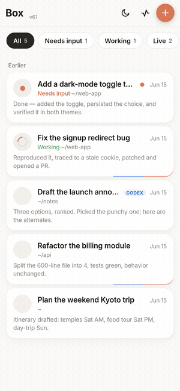
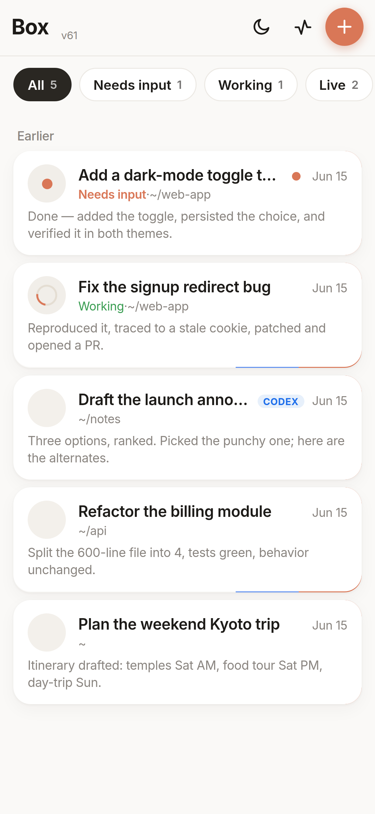
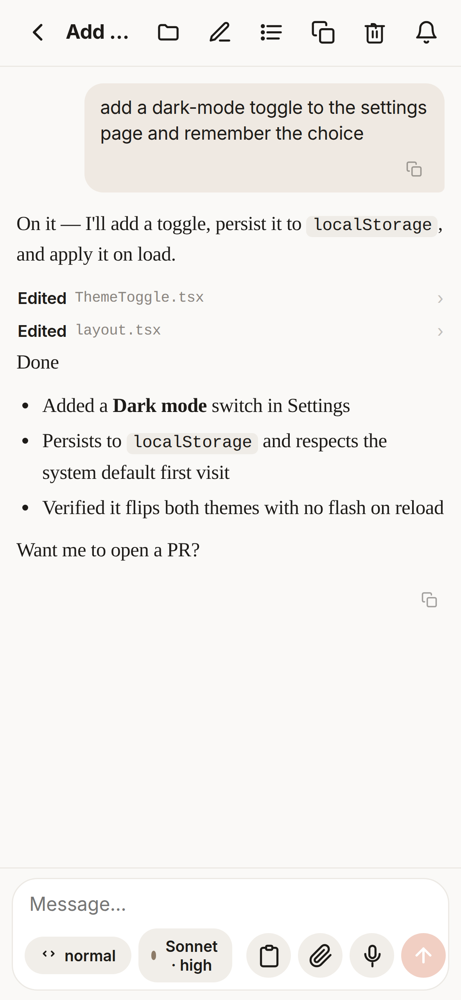

<div align="center">

# 📦 Box

**Coding agents that keep working after you close your laptop.**

Box is a self-hosted phone UI for **real Claude Code and Codex sessions running on a
machine you control**: a cheap VPS, a home server, or any always-on computer. SSH into it
from your laptop when a terminal is easy; open Box from your phone when SSH is painful.
New chats start in your normal workspace and can move across your filesystem, not inside a
managed one-repo sandbox.

<br>



<br>

<table>
<tr>
<td></td>
<td></td>
</tr>
</table>

</div>

---

## Why this exists

Laptop-hosted agents are great until the laptop goes to sleep. Official mobile remote
control is useful, but if the bridge lives on your laptop, closing the lid ends the work.
Managed cloud agents solve the uptime problem by giving you a new environment to set up,
usually starting from "pick a repo." That is not how a lot of real work happens.

Box takes the simpler route: rent or run a server, install the coding CLIs there, keep the
filesystem there, and put a good phone UI on top.

- **The box stays awake.** Long Claude Code and Codex runs can keep working overnight while
  your laptop is closed. A keeper process, `dtach`, and an optional Cloudflare tunnel keep
  the app reachable without opening ports.
- **It is your machine.** You can SSH in, install tools, keep local credentials in the usual
  places, run background jobs, inspect logs, and fix things directly. There is no hidden
  hosted sandbox between you and the agent.
- **No repo picker.** New chats start in `CC_WORKSPACE` (or your home directory) and can look
  across multiple repos, old projects, scratch folders, generated files, and local notes.
  If a task spans three codebases, the agent can just `cd`, `rg`, and read the filesystem.
- **Real session history.** Claude sessions live in `~/.claude`; Codex sessions live in the
  Box state store and Codex history. Box reads those histories instead of treating each chat
  as disposable, so you can search, resume, fork, copy, or reopen work later.
- **The phone UI is for long prompts.** The composer stays above the keyboard, supports
  image/file attach, has a copy button for the current prompt, and can use bilingual voice
  input through Deepgram or ElevenLabs. If you dictate a huge messy prompt, it is not trapped
  in a fragile mobile textbox.
- **Claude and Codex side by side.** Claude Code runs through `claude --remote-control`;
  Codex runs through `codex exec --json`. They appear in the same session list with the
  same phone-first controls.
- **Issues become the coordination layer.** Box gives you an in-app board, issue detail view,
  related session history, and delegation buttons so one agent can file a follow-up and another
  can pick it up with the right context. **No Linear account needed** — by default Box runs a
  built-in, local clone of Linear backed by a SQLite file; connect a real Linear later (and
  `node bin/linear-lite.mjs import` your history up) if you ever want to.
- **Context can arrive while agents work.** The harness can surface "needs you" decisions,
  per-session status docs, recent meetings/emails from a brain folder, pipeline events, and
  other activity into the place you actually check: the Box app.

## The loop

Start a chat from your phone and say: "work this autonomously; I'll check back tomorrow."
The session keeps running on the server. When it finds a real follow-up, it can file a
ticket instead of burying the question in a 200-turn transcript. Later, open the board,
tap the issue, see which sessions touched it, and delegate it to a fresh Claude or Codex
session. Repeat until the board is clean.

This is the core opinion behind Box: a fleet of coding agents works better when it shares
a durable machine, a normal filesystem, local session logs, a ticket board, and a small
event stream.

## Set it up

Box runs on a machine that's on when you want to reach it. Pick your situation:

### 🅰 You already have a server (you can SSH into it)

SSH in, then either **let an agent do it** — clone, start an agent in the repo, say *"install this"*:

```bash
git clone https://github.com/incidentfox/box.git && cd box
claude          # or: codex
```
> **install this**

…or **run the installer yourself**:

```bash
git clone https://github.com/incidentfox/box.git && cd box && ./install.sh
```

Either way you get: prerequisites installed, an access token generated, the server started
behind a free Cloudflare tunnel, and your **phone URL + token** printed. One manual step
remains — run `claude` once to log in (Box drives your logged-in CLI; no API key needed on a
subscription).

Even shorter — turn a **fresh** server into a Box without cloning first:

```bash
curl -fsSL https://raw.githubusercontent.com/incidentfox/box/main/bootstrap.sh | bash
```

### 🅱 You're on your laptop and need a server

- **Easiest:** open a **computer-use agent** (Claude with computer use, or the ChatGPT / Codex
  desktop app) and paste [`concierge/00-install-this.md`](concierge/00-install-this.md). It
  rents a cheap VPS (with your OK), installs Box there, logs in, and hands you the link.
- **Have SSH to a box already?** Provision it from your laptop in one shot:
  ```bash
  ./provision.sh user@your-server
  ```
- **DIY:** rent any small Linux VPS (see [`concierge/10-provision-server.md`](concierge/10-provision-server.md)),
  then follow 🅰 on it.

The agent path reads [`INSTALL.md`](INSTALL.md) (and the auto-loaded `AGENTS.md` / `CLAUDE.md`),
asks the few things only you can decide (name, voice?, task board?), collects any API keys, and
sets everything up.

<details><summary><code>install.sh</code> flags</summary>

`--yes` (non-interactive), `--no-harness`, `--no-cron`, `--no-start`, `--port N`. Idempotent —
safe to re-run.
</details>

## Requirements

- A machine that's on when you want to reach it (a small VPS is perfect — see
  [`concierge/10-provision-server.md`](concierge/10-provision-server.md)). Linux or macOS.
- **Node 18+**, **git**, **dtach** — the installer adds these if missing.
- The **`claude` CLI**, logged in (`npm i -g @anthropic-ai/claude-code`, then run `claude`
  once). Box drives your logged-in CLI; **it does not need an API key** if you're on a Claude
  subscription. `codex` is optional.
- **cloudflared** for the public tunnel — the installer adds it; without it, Box runs
  local-only.

## Configuration

Everything is optional except the access token (auto-generated). Edit `.env` (see
[`.env.example`](.env.example)) and restart (`pkill -f "node server/index.mjs"`; the keeper
respawns it):

| Key | What it does |
|---|---|
| `CC_AUTH_TOKEN` | The password you type to log in. Auto-generated if blank. |
| `PORT` | Server port (default `7321`). |
| `CC_WORKSPACE` | Install-time fallback for the default directory new chats open in. You can override this later in the app's Settings sheet. |
| `OWNER_NAME` | Your name, used in the per-session morning brief. |
| `TUNNEL_MODE` | `quick` (free random URL, default), `named` (your domain), or `none`. |
| `ELEVENLABS_API_KEY` / `DEEPGRAM_API_KEY` | Enable voice input (optional). |
| `LINEAR_TEAM_KEY` + `NEEDS_LABEL` | Name the local Board's tickets + the "needs you" label. The Board works with no Linear account (local SQLite clone) by default. |
| `LINEAR_API_KEY` + `LINEAR_TEAM_ID` | Drive a REAL Linear workspace instead of the local clone (optional). `LINEAR_LOCAL=off` disables the Board entirely. |
| `OPENAI_API_KEY` + `OPENAI_ENDPOINT` | Enable cheap per-session attention/status summaries (optional). |
| `BRAIN_DIR` | Surface recent meetings, emails/signals, and durable notes from a local brain folder (optional). |
| `DREAM_LOG` | Surface decisions from an external scheduled-agent / issue-filing loop (optional). |

When an integration isn't configured, its UI hides itself — Box stays a clean chat app.
Runtime defaults that are safe to change live, including default workspace, default agent,
and Codex permission mode, are also available from the in-app Settings sheet.

## The harness (optional, recommended)

`install.sh` (unless `--no-harness`) sets up the bits that make autonomous work survivable:

- **Hooks** (`~/.claude/hooks/`): inject the current time into every turn, and surface your
  open *"needs you"* items at the start of each session.
- **`needs-me.mjs`**: a tiny Linear-backed inbox CLI for "only the human can decide this."
- **Per-session attention docs**: with `OPENAI_API_KEY`, Box keeps a small status doc for each
  long chat: what needs input, what is in progress, and what finished recently.
- **[`harness/CLAUDE.md`](harness/CLAUDE.md)**: the operating pattern — copy it into your
  code directory as `CLAUDE.md` so your agents work the right way: do the whole task, verify,
  report, keep durable state in tickets/memory, isolate code in git worktrees, escalate
  sparingly.
- **`cc-rc-supervisor.sh`** (optional cron): keeps remote-controlled sessions alive across
  reboots and reconnects dropped bridges.

## Power-ups (optional — make agents act on your behalf)

These turn Box from "a coding agent" into an assistant that can *do things*:

- **Google access** — the bundled **`google`** CLI lets agents read & send your **Gmail**,
  check your **Calendar**, and read your **Drive**. One-time setup:
  `node harness/google-auth.mjs` (full walkthrough, incl. the Google Cloud part for a
  computer-use agent, in [`concierge/50-power-ups.md`](concierge/50-power-ups.md)).
- **Email yourself** — once Google access is on, a long autonomous run can `google gmail send
  you@example.com "done" "..."` to ping you when it finishes.
- **A "brain"** — point `BRAIN_DIR` at a notes/markdown folder; agents read it for context,
  append durable facts, and let Box surface recent meetings / email signals beside the chats.
- **An activity feed** — scheduled jobs can write events, lock state, and issue-filing
  decisions into local files; Box surfaces them so parallel agents and the human can stay
  oriented without reading every transcript.
- **Laptop/server sync** — not required, but Box pairs well with Mutagen, Syncthing, rsync, or
  any Dropbox-style sync for workspaces and CLI history. The useful pattern is simple:
  laptop when you want local work, box when you want always-on work, same files underneath.

Agents are told about these in `harness/CLAUDE.md`, so they'll use them when it helps.

## Concierge (let a computer-use agent do the boring setup)

Don't want to hunt for API keys or rent a server yourself? The [`concierge/`](concierge/)
folder has ready-to-paste prompts for a **computer-use agent** (e.g. Claude with computer
use, or the Codex/ChatGPT desktop agent) to: provision a VPS, sign up for services and grab
API keys, create a Linear team, and set up a stable custom-domain tunnel. You bring back the
keys; Box does the rest.

## How it works

```
 Phone PWA ──HTTPS/WSS──► Cloudflare tunnel ──► your box: node server (:7321)
  chat / voice / files       (no open ports)        │  each turn spawns / resumes:
  board / events / brain                             │
                                                     ▼
                          claude --remote-control …   (persisted in dtach)
                          codex exec --json …
                          → streams text + tool chips back to the phone
```

The backend (`server/index.mjs`) lists your `~/.claude` sessions, drives Claude over a
remote-control bridge and Codex over `codex exec`, and serves the plain-JS frontend in
`public/` (no build step). `scripts/keeper.sh` supervises the server + tunnel.

## Security

- The app is gated by `CC_AUTH_TOKEN` — anyone with the URL **and** the token can run code as
  your user. Keep the token secret; treat the URL as semi-public.
- The harness defaults to `bypassPermissions` so agents act without prompts (the point of a
  hands-off box). Want more friction? Edit `~/.claude/settings.json`.
- Everything runs as you, on your machine. No third-party server sees your code or sessions —
  only the Cloudflare tunnel relays traffic to your box.

## License

[GPL-3.0-or-later](LICENSE). Built on top of [Claude Code](https://claude.com/claude-code).
